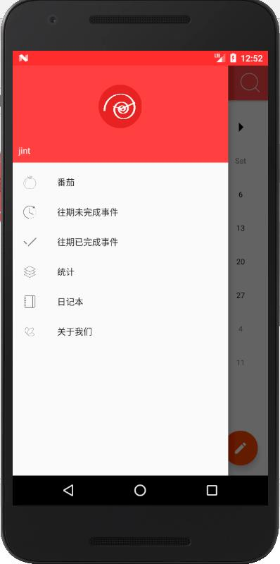
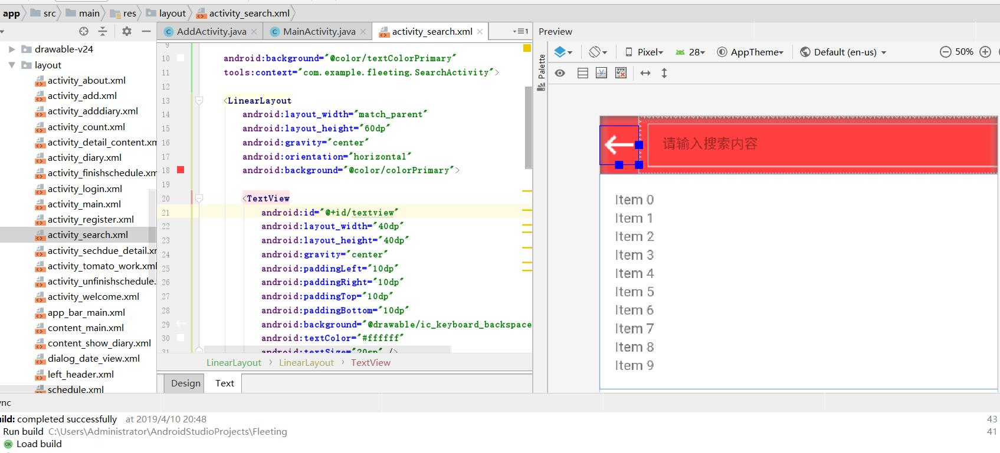
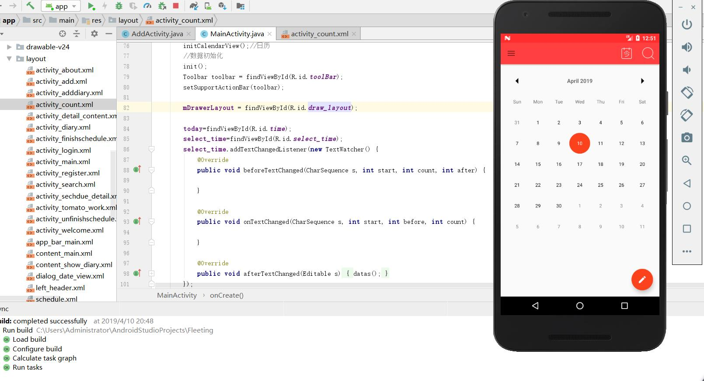
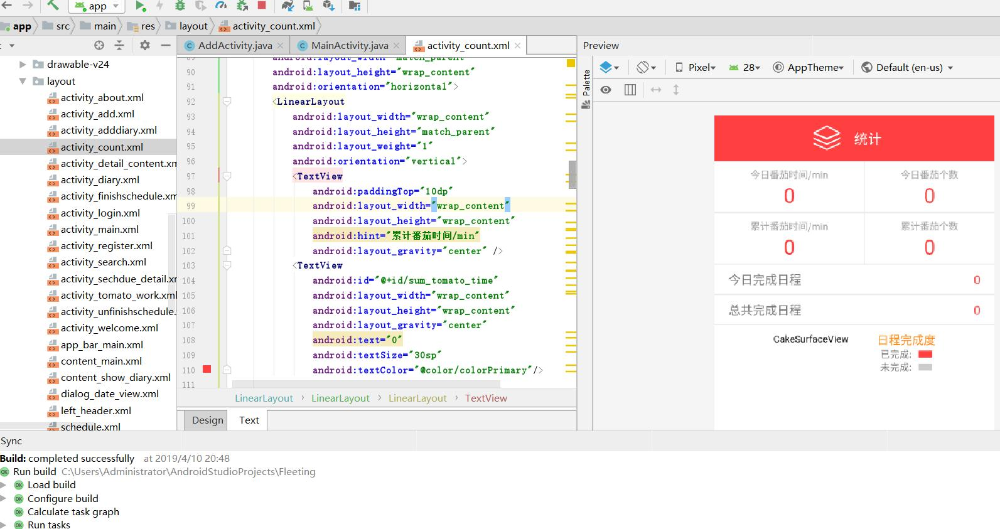

# Fleeting
Android Schedule management software_201903

Tomato work schedule management software

***main features***

***1 strong reminder function***

The software creatively uses the AlarmManager to manage the notification events. According to the reminder time set by the user, it regularly sends out the system broadcast, uses the broadcast receiver to start the notification and reminder service, and uses the strong reminder, vibration and reminder sound cycle on the notification and reminder service until the user views the schedule.

***2 schedule information management function***

Schedule information management combines with calendar control to display the schedule of the day according to the date the user clicks, which is convenient for the user to view.

Among them, schedule information management also creatively innovates the four quadrant rule of time management into the three-color level of schedule management urgency, which helps users control the urgency of tasks and improve the efficiency of accurate task time.

***3 schedule information statistics and diary***

The software provides an interface for users to manage the past schedule, including completed and unfinished schedules, and to count the completed and unfinished schedule data. Users can also use diary to record important events of the day.

***4 functions of tomato working method***

The tomato working method of this software is different from that of other schedule management software on the market. The software uses a custom animation class. In order to improve the user interaction, the user can set the duration of the tomato working method by hand gesture dynamically for countdown, and the user can make a custom setting according to the characteristics of their own work and learning. The database also records the history of tomato working method, which is convenient for users to view the history at any time. In order to achieve the incentive effect, the database records, convenient for users to make statistics on the tomato time, and according to the tomato time length, the users are awarded different levels of talent medal.